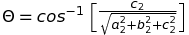
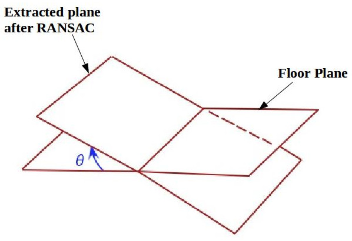

# camera_orientation Package
This package will let you find the **orientation of any RGBD camera** (Eg. Microsoft Kinect and Realsense camera series by Intel). This simple package will help to find the pitch and yaw of the camera and use it for various purpose.

### Intention
A cropbox is used to filter the region of interest in an input pointcloud and the output pointcloud is used for further operations. This package was written with the intention to stablize this output pointcloud by calculating the pitch angle of the camera and adjusting the rotation of the cropbox w.r.t this pitch angle so that the output pointcloud is always stable irrespective of the pitch of the camera.

### Math involved
The basic concept here is to find the angle enclosed between a reference plane and a plane extacted from the input pointcloud. 

Given two planes,

### <p align="center">Plane1: </p>

### <p align="center">Plane2: </p>

The angle(&theta;) between plane1 and plane2 is given by the equation,

#### <p align="center"></p>

Depending on what is being calculated (i.e, **pitch or yaw**), the reference plane can be either floor or the wall (See Fig 1). The Pitch and Yaw angles are shown in **Fig 2** and **Fig 3** respectively

Assuming all coefficients of reference plane as 1 for simplicity, the plane equtions can be reduced as,
### <p align="center">Reference plane:</p>

### <p align="center">Floor/Wall plane:</p>

We will get the values of a<sub>2</sub>, b<sub>2</sub>, c<sub>2</sub> usibgNow the equation for &theta; will reduce to,
### <p align="center"></p>

### <p align="center"></img><br>***Fig 1:Camera setup and description*** </p>

### <p align="center"></img><br>***Fig 2:Pitch angle between floor plane & plane extracted using RANSAC*** </p>

### <p align="center"></img><br>***Fig 3:Yaw angle between wall plane & plane extracted using RANSAC***</p>

### Working with this package

You can clone the package using the following command,

```
$ git clone https://github.com/brolinA/camera_orientation.git
```

### Parameters

Before launching the file make sure you have updated the following launch parameters depending on your need.

```html
1. <remap from="/camera/depth/color/points" to="/camera/depth/color/points" />
2. <param name="find_pitch" value="true"/>
3. <param name="find_yaw" value="false"/>
```
In line 1, remap the pointcloud topic to the appropriate one. Set the appropriate parameter (find_pitch or find_yaw)to true depending on what you would like to calculate i.e, Pitch or Yaw. Set both parameters to true if you want to calculate both at the same time

Launch the node using,

```
roslaunch camera_orientation camera_orientation.launch
```

The **Pitch and Yaw angle** will be published in **/pitch_angle** and **/yaw_angle** topics respectively
